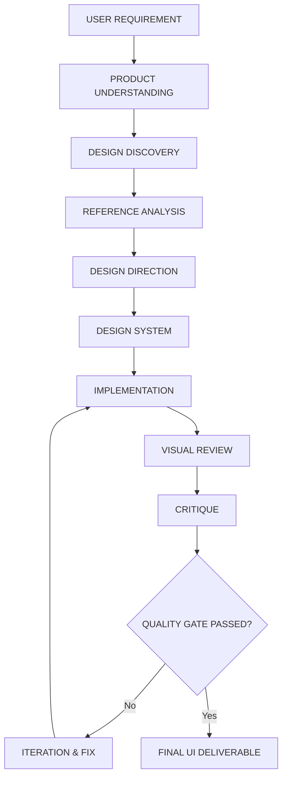

# DESIGN.md — Master Design Orchestration Rule for AI Software Engineer

> **Core Objective**: Guide AI to generate UI/UX with professional, intentional, distinctive, context-aware design taste, completely free from "AI slop", while maintaining high standards of usability, accessibility, and engineering rigor.

---

## 🏗️ Conceptual Foundation & Project Integrations

This orchestration rule conceptually unifies 4 specialized AI design methodologies into a single cohesive workflow:

1. **[screenshot-to-design-system](https://github.com/WCF900905/screenshot-to-design-system)** — *Reference & System Extraction Layer*
   - Analyzes reference screenshots and visual assets.
   - Extracts typography, color scales, spacing systems, hierarchy, component primitives, and design tokens.
   - Converts visual inspirations into actionable design systems without blind pixel-copying.

2. **[open-design](https://github.com/nexu-io/open-design)** — *Creative & Visual Direction Layer*
   - Determines distinct visual identity tailored specifically to the product context.
   - Establishes custom typography pairings, color strategy, layout composition, and motion identity.
   - Rejects template-driven design defaults in favor of intentional visual storytelling.

3. **[anti-slop-design](https://github.com/Ferousco-dev/anti-slop-design)** — *Anti-AI-Slop Quality & Context Guard*
   - Detects generic, predictable, default-looking UI patterns.
   - Evaluates design choices against the principle: **"Avoid defaults, not design patterns."**
   - Ensures design patterns (cards, gradients, shadows, animations) are used intentionally, not lazily.

4. **[design-loop](https://github.com/tonymfer/design-loop)** — *Visual Verification & Iteration Engine*
   - Executes visual review post-implementation by rendering the app and capturing real viewport screenshots.
   - Performs objective visual critique on hierarchy, spacing, typography, contrast, alignment, and responsiveness.
   - Iterates iteratively until the UI passes all Quality Gate benchmarks.

---

## 🔄 Design Orchestration Pipeline



---

## ⚖️ Hierarchy of Authority

When conflicts arise during design or implementation, decisions **must** strictly follow this order of priority:

1. **User Explicit Requirements** (Non-negotiable functional/business constraints)
2. **Product / Business Requirements** (Core value proposition, key user tasks)
3. **Accessibility & Usability** (WCAG standards, readability, tap targets, focus states)
4. **Brand Requirements** (Brand identity, voice, tone, mandatory brand assets)
5. **DESIGN.md Principles** (Rules & guidelines outlined in this document)
6. **Reference Designs** (Inspirations provided by the user)
7. **Extracted Design System** (Established design tokens and primitive scale)
8. **Anti-Slop Rules** (Filtering out generic AI aesthetic defaults)
9. **AI Creative Judgment** (Fine-grained aesthetic adjustments)

---

## 🎯 Core Design Principles

- **Never Start From a UI Template**: Every product deserves a custom layout structured around its unique information architecture.
- **Understand Before Designing**: Never write UI code without understanding the product's purpose, target user, and key action.
- **Never Select Style for Popularity Alone**: Trends pass; functional appropriateness endures.
- **Every Visual Decision Needs a Reason**: Color, font weight, border radius, and spacing must serve hierarchy, clarity, or brand identity.
- **Avoid Default AI Aesthetics**: Reject the impulse to output predictable purple gradients, floating blurred cards, and generic SaaS hero sections by default.
- **Avoid Unnecessary Decoration**: Decorative elements that do not aid comprehension or visual rhythm are noise.
- **Design for Hierarchy, Usability & Identity**: The screen must immediately communicate what is most important within 3 seconds.
- **References are Evidence, Not Clones**: Use reference designs to analyze principles, spacing rhythm, and visual weight — never to pixel-copy.
- **Accept Standard Patterns when Contextually Right**: Do not avoid common patterns (tabs, forms, cards) out of fear of anti-slop; use them when they are genuinely the best solution.
- **Intentionality Over Novelty**: Predictable usability beats confusing originality.
- **Visual Hierarchy Over Decoration**: Use scale, contrast, whitespace, and font weight before reaching for background colors or borders.
- **Motion Must Have Purpose**: Animations guide focus, indicate state change, or establish spatial relationships — never mask poor layouts.
- **Responsive Behavior is Designed, Not Patched**: Mobile layout is a first-class consideration, not an afterthought media query fix.

---

## 🛡️ Anti-Slop Principle: "Avoid Defaults, Not Design Patterns"

Instead of creating a rigid list of banned UI features, the AI must ask this core question for every visual choice:

> **"Apakah elemen ini dipilih karena memang cocok dengan produk, atau karena AI secara default sering menggunakannya?"**
>
> *(Is this element chosen because it genuinely fits the product, or because it is an AI default output?)*

| Pattern | Default AI Slop Context ❌ | Contextually Justified Usage ✅ |
| :--- | :--- | :--- |
| **Gradients** | Purple-to-blue background on every hero section without brand justification. | Subtle directional ambient glow reinforcing primary action focus or organic product brand tone. |
| **Rounded Cards** | Nested 24px rounded cards inside rounded cards for basic text items. | Softly rounded containers grouping distinct complex data clusters to reduce cognitive load. |
| **Glassmorphism** | Semi-transparent blurred panels stacked over busy background images. | Sticky navigation bar background maintaining backdrop context while scrolling heavy text. |
| **Pills & Badges** | Bright colored pill tags cluttering every header and card title. | Status indicator badge communicating operational state (e.g., "Active", "Pending", "Out of Stock"). |
| **Animations** | Bouncing hero text and entrance fades on every single scroll element. | Smooth accordion expansion, tab transition, or micro-feedback on primary button click. |
| **Typography** | Inter / System Sans applied indiscriminately to artisanal food or luxury sites. | Modern sans-serif chosen specifically for tech dashboards; warm serif chosen for artisanal culinary brand. |

---

## 🔍 Phase 1: Design Discovery Checklist

Before writing any code or components, complete this discovery mental model:

- [ ] **Product Identity**: What is the core product/service being built?
- [ ] **Target Audience**: Who is the end user? What is their tech literacy and usage context?
- [ ] **Page Objective**: What is the single most important goal of this screen?
- [ ] **Primary Action**: What action should the user take first?
- [ ] **Information Hierarchy**: What are the top 3 pieces of information in order of importance?
- [ ] **Brand Personality**: Is the brand warm, professional, rustic, sleek, playful, or authoritative?
- [ ] **Industry Context**: What visual expectations exist in this domain (e.g., UMKM culinary vs. fintech)?
- [ ] **Target Devices**: Mobile-first, desktop-first, or balanced responsive?
- [ ] **Accessibility Requirements**: Contrast ratio (WCAG AA min 4.5:1), keyboard nav, clear touch targets (min 44x44px).
- [ ] **Competitive Differentiation**: What makes this interface feel distinct from competitor templates?

---

## 🎨 Phase 2: Design Direction & System Setup

Before coding, explicitly define these 12 design decisions:

1. **Visual Personality**: (e.g., "Warm artisanal culinary with high editorial clarity")
2. **Typography Direction**: Display font + Body font pairing with distinct scale ratio.
3. **Color Strategy**: Dominant surface color, high-contrast text color, 1 distinct accent color, functional feedback colors.
4. **Spacing & Rhythm**: Base unit grid (e.g., 4px / 8px scale: 4, 8, 12, 16, 24, 32, 48, 64, 96px).
5. **Layout Strategy**: Asymmetric grid, structured editorial columns, or focused single-column flow.
6. **Component Language**: Crisp borders vs. soft background fills vs. clean whitespace separation.
7. **Imagery Strategy**: High-quality authentic photography, custom illustrations, or crisp product renders.
8. **Iconography**: Consistent stroke width, optical alignment, and semantic usage.
9. **Border & Radius Strategy**: Consistent radius token scale (e.g., sharp 0px, subtle 4px, medium 8px, soft 12px).
10. **Elevation & Shadow Strategy**: Flat high-contrast vs. soft ambient multi-layered shadows.
11. **Motion Strategy**: Transition duration tokens (150ms ease-out for hover, 300ms cubic-bezier for modals).
12. **Responsive Behavior Plan**: Layout reflow behavior at 320px, 640px, 1024px, 1440px.

---

## 👁️ Phase 3: Reference Analysis (If Reference Provided)

When analyzing reference screenshots or inspiration links:

1. **Structure Analysis**: How is the page broken into major structural regions?
2. **Hierarchy Extraction**: How does the eye move across the screen? What grabs attention first, second, third?
3. **Typography Audit**: Font pairings, weight contrasts, line-heights, letter-spacing.
4. **Color & Palette Mapping**: Primary, secondary, neutral, and accent color proportions (60-30-10 rule).
5. **Spacing Rhythm**: Density of padding, margin relationships between elements.
6. **Component Pattern Identification**: How are list items, cards, headers, and controls structured?
7. **Visual Balance**: Symmetrical vs. asymmetrical composition, focal points.
8. **Imagery & Texture**: Photography style, background treatments, subtle overlays.
9. **Interaction Cues**: How affordances (buttons, links, inputs) signal clickability.
10. **Core Aesthetic Qualities**: What specific quality makes this design feel refined?
11. **Separation of Rules vs. Details**: Distinguish foundational layout principles from superficial decorations.
12. **Adaptive Synthesis**: Apply extracted principles adaptively to the current project context without pixel cloning.

---

## 💻 Phase 4: Implementation Standards

During coding:

- **Semantic HTML First**: Use `<header>`, `<nav>`, `<main>`, `<section>`, `<article>`, `<aside>`, `<footer>`, `<button>`, `<input>`.
- **Accessibility Embedded**:
  - All interactive elements must have visible focus rings (`focus-visible:ring-2`).
  - Color contrast must meet WCAG AA standards.
  - Form fields must have associated `<label>` elements or `aria-label`.
- **Strict Token Usage**: Utilize CSS variables or Tailwind `@theme` tokens. Avoid arbitrary random pixel values (`p-[13px]`, `text-[17.5px]`) unless mathematically required.
- **Complete State Coverage**: Always implement and style:
  - `default`
  - `hover`
  - `focus-visible`
  - `active`
  - `loading` / `skeleton`
  - `empty state`
  - `error state`
  - `disabled`
- **Standalone Layout Integrity**: The layout must look structured, legible, and visually balanced even if all CSS animations are disabled.

---

## 🔍 Phase 5: Visual Review & Critique Engine

After implementing code, execute the visual verification loop:

### 1. Render & Capture
- Start local development server.
- Capture screenshots across Desktop (1440x900) and Mobile (375x812) viewports.

### 2. Standard Critique Format
For every visual defect identified during inspection, log:

```markdown
ISSUE: [Clear description of what is visually wrong or unrefined]
WHY: [Why this harms usability, visual hierarchy, brand identity, or readability]
SEVERITY: [Critical | High | Medium | Low]
RECOMMENDATION: [Specific code or design adjustment to make]
EXPECTED RESULT: [Visual change expected after fixing]
```

### 3. Iteration Rule
- **Fix in Isolation**: Modify code targeting specific critique items without breaking working components.
- **Re-render & Inspect**: Take a new screenshot and confirm improvement before declaring done.

---

## 🚪 Phase 6: Quality Gate Criteria

A UI is **NOT** finished just because the build succeeds and there are no terminal errors. 

A UI is **COMPLETE** only when it satisfies all conditions in this Quality Gate:

- [ ] **Visual Hierarchy**: The primary action and main information are clear within 3 seconds.
- [ ] **Typography Clarity**: Headings, body text, and captions have intentional size, weight, and line-height contrast.
- [ ] **Spacing Consistency**: Spacing follows a consistent grid rhythm without awkward gaps or cramped text.
- [ ] **Brand Identity**: The UI reflects a distinct, intentional personality suited to the product domain.
- [ ] **Interaction States**: All buttons, inputs, links, and cards have polished hover, focus, active, and disabled states.
- [ ] **Responsive Reflow**: The layout works fluidly from 320px mobile to 1440px+ widescreen without horizontal scroll bugs.
- [ ] **Accessibility Compliance**: Text contrast meets WCAG AA standards; all controls are keyboard operable.
- [ ] **Zero AI Slop**: No unneeded background gradients, floating cards, or generic placeholder templates exist without contextual justification.
- [ ] **Cohesive Whole**: The interface feels like a single unified design system, not a stitched collection of random components.

---

## ❓ Phase 7: Self-Critique Checklist (Pre-Delivery)

Before declaring delivery, answer these 15 questions:

1. Did I choose this design because it fits the product, or because it was my default habit?
2. Is the interface visually recognizable even if the brand logo is removed?
3. Is the primary visual hierarchy obvious within 3 seconds?
4. Are there any purely decorative elements that add no functional or visual clarity?
5. Does the typography pairing have character, high legibility, and proportional scale?
6. Is there a clear, rhythmic spacing system across all sections?
7. Did I overcrowd the page with unnecessary components or cards?
8. Are all card containers genuinely necessary to group information?
9. Does this look like a generic SaaS template? If yes, how can I make it more contextually distinct?
10. Am I avoiding a common, useful UI pattern out of an over-correction against AI slop?
11. Does this design directly assist the user in completing their primary goal?
12. Is the visual language consistent across all sections and sub-components?
13. Is the design clean, readable, and functional without any CSS animations enabled?
14. Is the mobile experience thoughtfully designed rather than cramped?
15. If a Senior Product Designer reviewed this UI, what would be their very first criticism?

---

## 💎 Definition of Professional Design

> **Professional Design = Intentional + Contextual + Usable + Coherent + Accessible + Distinctive + Visually Refined**

*A design is not professional because it has dark mode, glassmorphism, animations, or Tailwind; it is professional because every single pixel, color, font, and space exists for an intentional purpose.*
